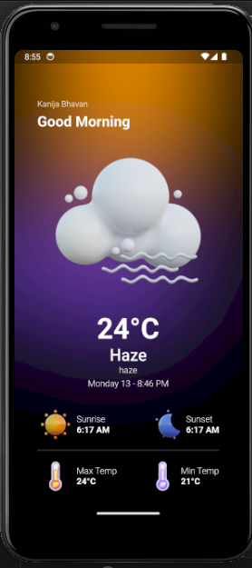

# Flutter Weather App

A Flutter application that fetches and displays weather information using the `weather` package and manages data using the `bloc` package.



## Features

- Display current weather information.
- View detailed weather forecasts.
- Search for weather information in different locations.
- ...

## Getting Started

### Prerequisites

- Ensure you have Flutter installed. For instructions, refer to the [Flutter installation guide](https://flutter.dev/docs/get-started/install).
- Clone this repository.

```bash
git clone https://github.com/your-username/flutter-weather-app.git
cd flutter-weather-app
```

### Installation
Open a terminal and navigate to the project root.
Run the following command to get the dependencies:

```bash
flutter pub get
```

### Usage
Launch the app on an emulator or physical device:
```bash
flutter run
```

Explore the weather information for different locations using the app.

### Dependencies

#### Packages Used

 - geolocator: Flutter plugin for accessing geolocation information.
 - weather: A Flutter package for fetching weather data.
 - intl: Internationalization and localization support.
 - flutter_bloc: A predictable state management library for Flutter applications.
 - equatable: Equality comparisons without boilerplate.